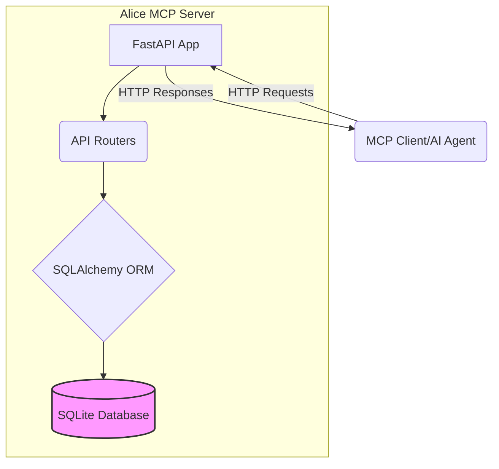

# Alice MCP Server - Application Overview

## 1. Project Overview

**Purpose:** Alice MCP Server is a lightweight, local server designed to support agile task workflows within AI coding environments. It provides a backend for managing tasks, epics, and messages, with project isolation.

**Project ID:** `alice-mcp` (Used for tracking tasks via the Alice MCP tool)

**Target Users:** Developers using AI coding assistants (like Claude, ChatGPT, etc.) who need a simple, local system to manage project tasks and context.

**Use Cases:**
- Tracking development tasks for different software projects.
- Organizing related tasks into epics.
- Maintaining a communication log (messages) associated with specific tasks.
- Providing a structured backend for AI agents to interact with project management data locally.

## 2. System Architecture

Alice is built as a standard RESTful API server.



**Components:**
- **FastAPI Application (`app/main.py`):** The main entry point, handling request/response lifecycle, middleware, and exception handling.
- **API Routers (`app/routers/`):** Define API endpoints for different resources (Projects, Tasks, Epics, Messages).
- **SQLAlchemy ORM (`app/models.py`, `app/database.py`):** Manages database interactions, defining data models and handling sessions.
- **Pydantic Schemas (`app/schemas.py`):** Define data shapes for request validation and response serialization.
- **SQLite Database:** A single file (`./alice.db` by default, though not explicitly configured yet) storing all project data.

**Data Flow:**
1. An MCP client (or AI agent) sends an HTTP request to a specific API endpoint.
2. FastAPI routes the request to the appropriate router function.
3. The router function uses Pydantic schemas to validate input data.
4. SQLAlchemy ORM interacts with the SQLite database to perform CRUD operations.
5. Pydantic schemas serialize the response data.
6. FastAPI sends the HTTP response back to the client.

**Integration with MCP:**
Alice acts as a server component within the Model Context Protocol (MCP) ecosystem. It exposes tools (via its API) that MCP-compatible clients (like AI agents) can use to manage project tasks.

## 3. Key Features

- **Project Isolation:** Tasks, Epics, and Messages are scoped to specific Projects. This allows managing multiple distinct software projects without data overlap.
- **Task Management:** Create, Read, Update, Delete (CRUD) operations for tasks. Tasks include title, description, status, assignee, and timestamps.
- **Epic Management:** Group related tasks under Epics. Epics also have CRUD operations and share similar attributes with tasks.
- **Message Tracking:** Log messages or notes against specific tasks, including author and timestamp.
- **Status History:** (Schema exists, but API endpoint not implemented in `REQUIREMENTS.md`) Track changes in task status over time.

## 4. Technical Stack

- **Backend Framework:** FastAPI
- **Database ORM:** SQLAlchemy
- **Data Validation/Serialization:** Pydantic
- **Database:** SQLite 3.x
- **API Documentation:** Swagger UI & ReDoc (auto-generated by FastAPI)
- **Testing:** pytest
- **Linting/Formatting:** flake8, black, isort (as per `REQUIREMENTS.md`)

## 5. Database Schema

```mermaid
erDiagram
    PROJECT ||--o{ EPIC : contains
    PROJECT ||--o{ TASK : contains
    EPIC ||--o{ TASK : groups
    TASK ||--o{ MESSAGE : has
    TASK ||--o{ STATUS_HISTORY : logs

    PROJECT {
        int id PK
        string name UK
        datetime created_at
    }

    EPIC {
        int id PK
        string title
        string description NULL
        TaskStatus status
        datetime created_at
        datetime updated_at NULL
        string assignee NULL
        int project_id FK
    }

    TASK {
        int id PK
        string title
        string description NULL
        TaskStatus status
        datetime created_at
        datetime updated_at NULL
        string assignee NULL
        int epic_id FK NULL
        int project_id FK
    }

    MESSAGE {
        int id PK
        int task_id FK
        string author
        string message
        datetime timestamp
    }

    STATUS_HISTORY {
        int id PK
        int task_id FK
        TaskStatus old_status
        TaskStatus new_status
        datetime changed_at
    }

    enum TaskStatus {
        To-Do
        In-Progress
        Done
        Canceled
    }
```

**Tables:**
- `projects`: Stores project definitions (ID, name).
- `epics`: Stores epic details, linked to a project.
- `tasks`: Stores task details, linked to a project and optionally an epic.
- `messages`: Stores messages associated with tasks.
- `status_history`: Logs status changes for tasks.

## 6. API Endpoints

All endpoints (except `/projects`) are prefixed with the `project_id`.

**Projects (`/projects`)**
- `POST /`: Create a new project.
- `GET /`: List all project names.
- `GET /{project_id}`: Get project details by ID.
- `GET /by-name/{project_name}`: Get project details by name.

**Tasks (`/{project_id}/tasks`)**
- `POST /`: Create a task within the project.
- `GET /`: List tasks within the project (with filters).
- `GET /{task_id}`: Get a specific task.
- `PUT /{task_id}`: Update a task.
- `DELETE /{task_id}`: Delete a task.
- `PUT /{task_id}/move/{target_project_id}`: Move a task to another project.

**Epics (`/{project_id}/epics`)**
- `POST /`: Create an epic within the project.
- `GET /`: List epics within the project (with filters).
- `GET /{epic_id}`: Get a specific epic.
- `PUT /{epic_id}`: Update an epic.
- `DELETE /{epic_id}`: Delete an epic.
- `GET /{epic_id}/tasks`: Get all tasks associated with an epic.

**Messages (`/{project_id}/tasks/{task_id}/messages`)**
- `POST /`: Add a message to a task.
- `GET /`: Get all messages for a task.

*(Note: Status History endpoints are defined in the schema but not listed as required API endpoints in `REQUIREMENTS.md`)*

## 7. Development Workflow

**Setup:**
1. Clone the repository.
2. Create a Python virtual environment (`python -m venv venv`).
3. Activate the environment (`source venv/bin/activate` or `venv\Scripts\activate`).
4. Install dependencies (`pip install -r requirements.txt`).
5. Run the server (`uvicorn app.main:app --reload`).

**Testing:**
- Run tests using `pytest`.
- Aim for >80% test coverage.
- Includes unit tests and integration tests for API endpoints.

**Contribution Guidelines:**
- Follow PEP 8 style guide.
- Use type hints.
- Document public functions and APIs.
- Write tests for new features or bug fixes.
- Ensure linting (`flake8`) and formatting (`black`, `isort`) checks pass.

## 8. Deployment

**Local:**
- Run using `uvicorn`.
- Uses a local SQLite file.
- Default port: 8000.

**Production:**
- Consider using a more robust database (e.g., PostgreSQL).
- Use a production-grade ASGI server (e.g., Uvicorn with Gunicorn workers).
- Configure logging, monitoring, and backups.
- Docker support is optional but recommended for easier deployment.
